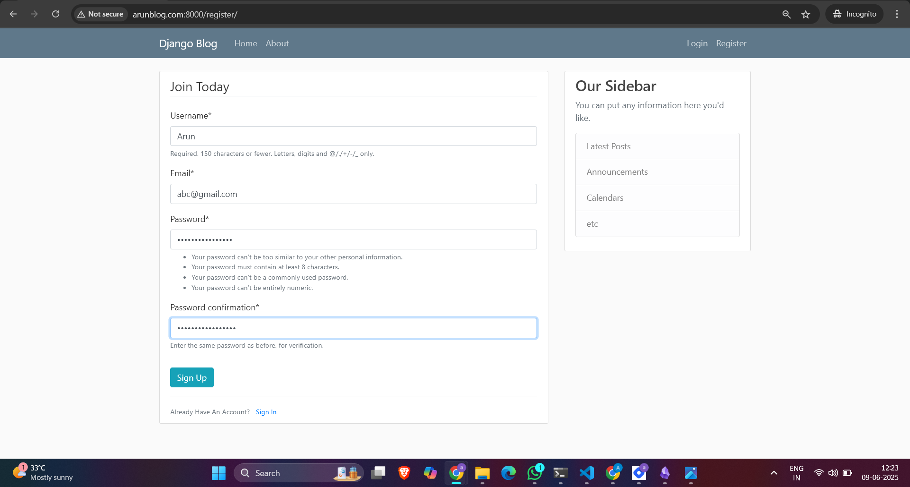
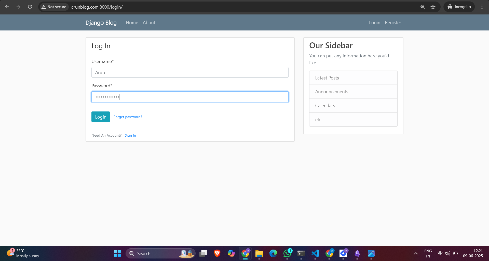
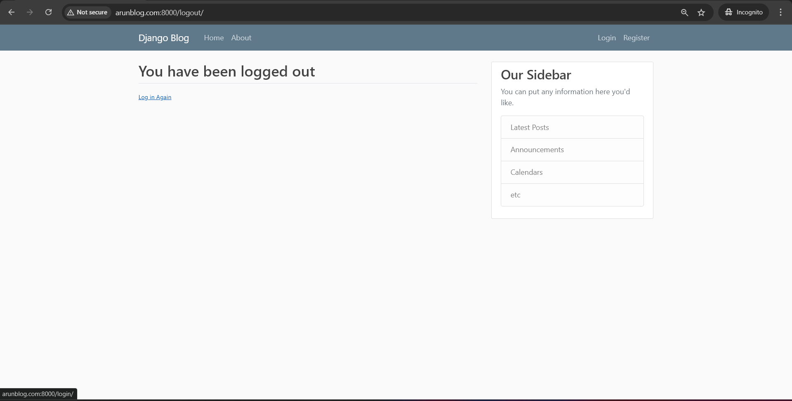
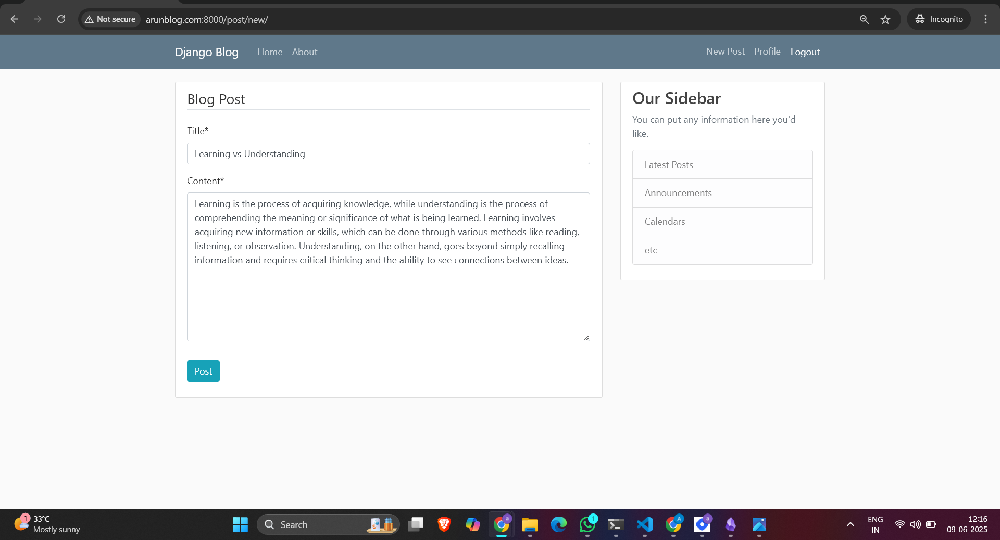
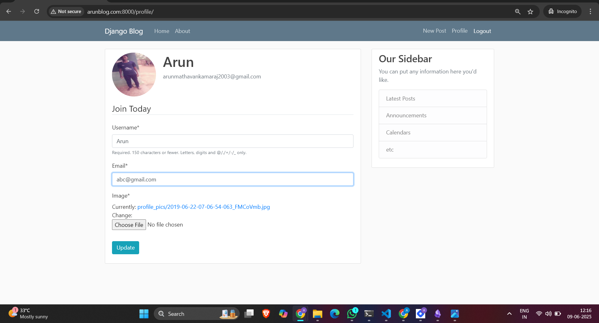
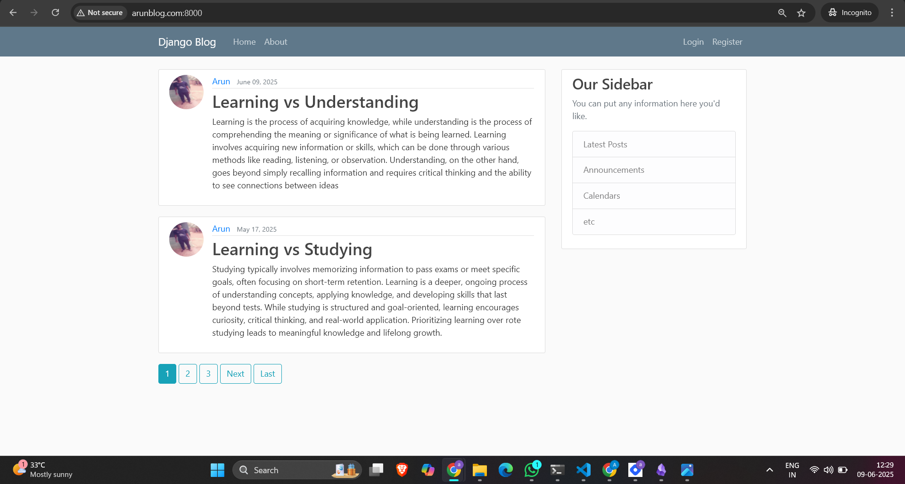
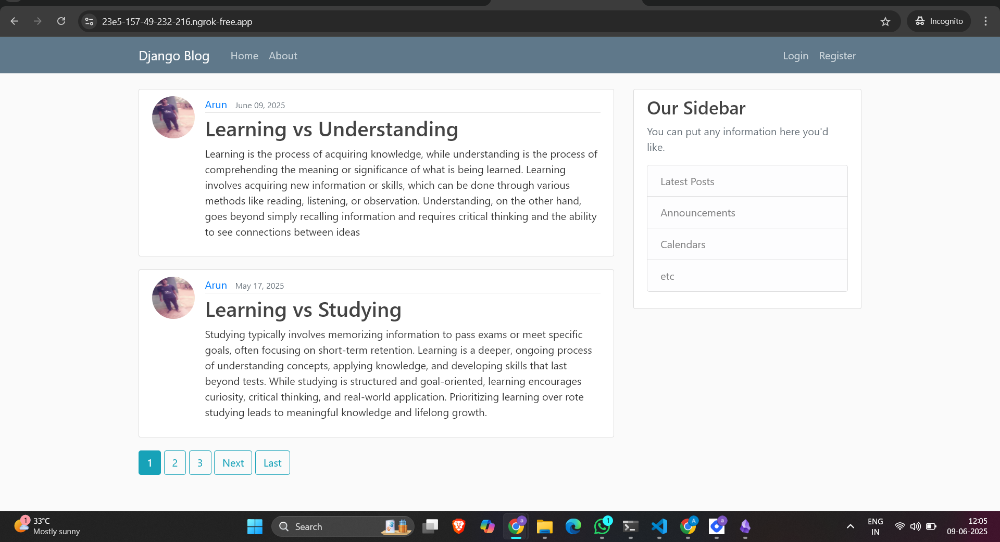
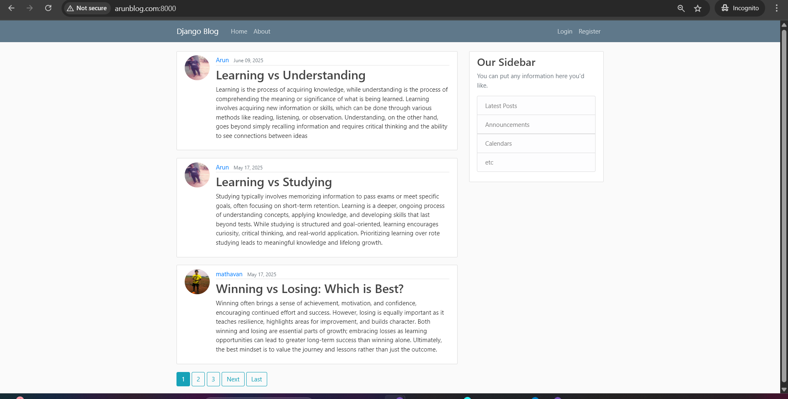

                                       Django Blog project
                                       
I've been learning python for the past one year. Doing some small projects like this has helped me for stong foundation in key understanding concepts. In this project I created using Python and Django for backend, HTML, CSS and Bootstrap for frontend design. 

   -  User authentication
   -  CRUD Operations
   -  Email sending
   -  Pagination
   -  Ngrok for secure testing
   -  Custom domain integration for testing

Here I attached all the screenshots:

   1. Register Page
      Users can create a new account to access blog features.
      

   2. Login Page  
      Login with a registered email and password.
      
      
   3. Logout Confirmation  
      Log out securely with confirmation.
      
 
   4. Email Sent Page  
      Confirmation after password reset or registration email is sent.
      [Email Sent Page](images/email_sent.png)
      
   5. New Post Page  
      Create a new blog post with a title and content.
      

   6. Profile Page  
      Displays user profile information and posts authored.
      

   7. Pagination Page  
      Navigates through blog posts across multiple pages.
      
      
   8. Ngrok Secure Page  
      Secure login testing using Ngrok tunnel.
      
      
   9. Custom Domain Setup (Optional)
      Project configured with a custom domain.
      

To run this project locally:
```gitbash
git clone https://github.com/ArunmathavanK/Blog.git
cd Blog
python -m venv venv
venv\Scripts\activate
pip install -r requirements.txt
python manage.py migrate
python manage.py runserver

#create a .env file if you using secret details
