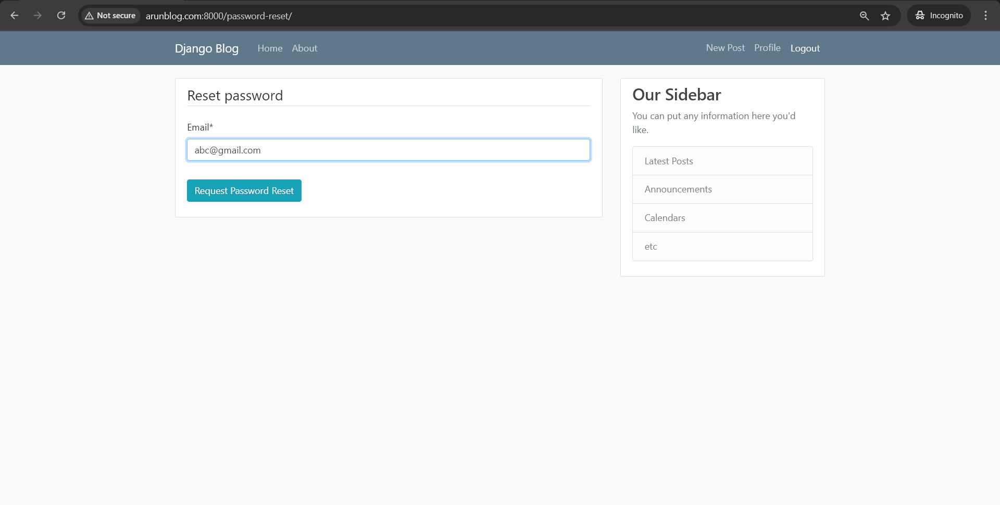

Django Blog project
I've been learning python for the past one year. Doing some small projects like this has helped me for stong foundation in key understanding concepts. In this project I created using:
   -  Python and Django for backend
   -  HTML and CSS for frontend design
   -  User authentication
   -  Post management
   -  Email sending
   -  Pagination
   -  Ngrok for secure testing
   -  Custom domain integration for testing

Here I attached all the screenshots:

   1. Register Page
      Users can create a new account to access blog features.


---

### 🔐 2. Login Page  
Login with a registered email and password.

("C:\Users\ARUN\Documents\Django_projects\BLOGG\BLOGG\images\ngrok_secure.png")C:\Users\ARUN\Documents\Django_projects\BLOGG\BLOGG\images\custom_domain.png

---

### 🚪 3. Logout Confirmation  
Log out securely with confirmation.


---

### 📧 4. Email Sent Page  
Confirmation after password reset or registration email is sent.



---

### 📝 5. New Post Page  
Create a new blog post with a title and content.


---

### 👤 6. Profile Page  
Displays user profile information and posts authored.


---

### 📄 7. Pagination Page  
Navigates through blog posts across multiple pages.


---

### 🏠 8. Homepage  
Main page displaying all recent blog posts.


---

### 🔐 9. Ngrok Secure Page  
Secure login testing using Ngrok tunnel.


---

### 🌐 10. Custom Domain Setup (Optional)
Project configured with a custom domain.


---

## 🚀 Project Setup

To run this project locally:

```bash
git clone https://github.com/ArunmathavanK/Blog.git
cd Blog
python -m venv venv
source venv/bin/activate    # On Windows: venv\Scripts\activate
pip install -r requirements.txt
python manage.py migrate
python manage.py runserver
